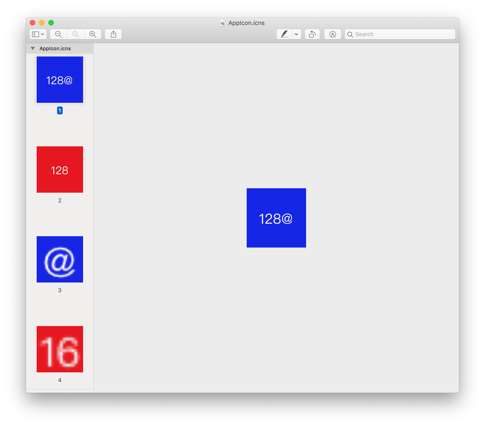

# testIconFormat

Xcode 11 still has bug with converting png files into icns file.

## Steps to reproduce problem

1. Create images for icon in Sketch
	
	Create 10 images in Sketch and export with following names and resolutions:

	Name|Resolution|
	----|---- |
	16.png | 16 x 16 |
	16@2x.png | 32 x 32 |
	32.png | 32 x 32 |
	32@2x.png | 64 x 64 |
	128.png | 128 x 128 |
	128@2x.png | 256 x 256 |
	256.png | 256 x 256 |
	256@2x.png | 512 x 512 |
	512.png | 512 x 512 |
	512@2x.png | 1024 x 1024 |

	All images' DPI is 72 pixels/inch.

	

2. Create a new Xcode project for macOS application

3. Drag 10 images into Xcode->Assets.xcassets->AppIcon

	

4. Run the project and command+click Dock icon to reveal testIconFormat.app in Finder
	
	In Xcode's console, the log shows AppIcon has 10 representations with size as step 1.
	
	```
	<NSImage 0x600001769b00 Name=AppIcon Size={128, 128} Reps=(
    "NSCGImageRep 0x600001769800 Size={16, 16} ColorSpace=sRGB IEC61966-2.1 colorspace BPS=0 Pixels=16x16 Alpha=NO AppearanceName=(null)",
    "NSCGImageRep 0x600001769cc0 Size={32, 32} ColorSpace=sRGB IEC61966-2.1 colorspace BPS=0 Pixels=32x32 Alpha=NO AppearanceName=(null)",
    "NSCGImageRep 0x600001769e80 Size={128, 128} ColorSpace=sRGB IEC61966-2.1 colorspace BPS=0 Pixels=128x128 Alpha=NO AppearanceName=(null)",
    "NSCGImageRep 0x60000176a000 Size={256, 256} ColorSpace=sRGB IEC61966-2.1 colorspace BPS=0 Pixels=256x256 Alpha=NO AppearanceName=(null)",
    "NSCGImageRep 0x60000175bc80 Size={512, 512} ColorSpace=sRGB IEC61966-2.1 colorspace BPS=0 Pixels=512x512 Alpha=NO AppearanceName=(null)",
    "NSCGImageRep 0x60000176c500 Size={16, 16} ColorSpace=sRGB IEC61966-2.1 colorspace BPS=0 Pixels=32x32 Alpha=NO AppearanceName=(null)",
    "NSCGImageRep 0x60000176c700 Size={32, 32} ColorSpace=sRGB IEC61966-2.1 colorspace BPS=0 Pixels=64x64 Alpha=NO AppearanceName=(null)",
    "NSCGImageRep 0x60000176c8c0 Size={128, 128} ColorSpace=sRGB IEC61966-2.1 colorspace BPS=0 Pixels=256x256 Alpha=NO AppearanceName=(null)",
    "NSCGImageRep 0x60000176ca40 Size={256, 256} ColorSpace=sRGB IEC61966-2.1 colorspace BPS=0 Pixels=512x512 Alpha=NO AppearanceName=(null)",
    "NSCGImageRep 0x60000176cbc0 Size={512, 512} ColorSpace=sRGB IEC61966-2.1 colorspace BPS=0 Pixels=1024x1024 Alpha=NO AppearanceName=(null)"
)>
	```

5. Right click icon of testIconFormat.app, Show Package Contents->Contents->Resources, you can see AppIcon.icns

6. Open AppIcon.icns with Preview.app

7. Open Preview's side bar (View->Thumbnails), you can see 4 formats.

	


## Why few developers complaint about this bug?

After compiling and building, the testIconFormat.app is ready. If you check it in Finder, it just works fine on non retina and non-retian displays. When scaling, all formats are displayed smoothly.

Resizing on non retian display.


Resizing on retian display.

Most people will not discover this issue(no traces at all), except who cares about the icns file.

## Alternative plan

Some developers reported a bug on [Radar](https://openradar.appspot.com/35152727) about `iconutil` problem. But as my test, `iconutil` is correct on Mojave. So the core reason may not be `iconutil`.

Get back to the point, the right way and also old-school way is, use other tools to generate icns file and put it into Xcode project.

After some testing, I'm sure [Icon Slate](https://www.kodlian.com/apps/icon-slate) can handle this properly.